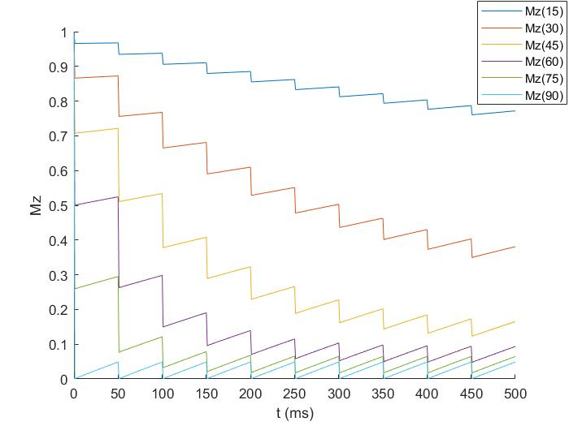
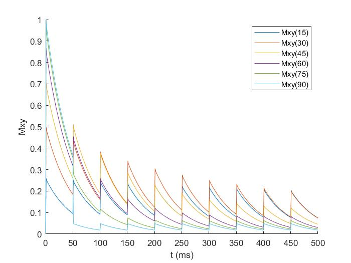
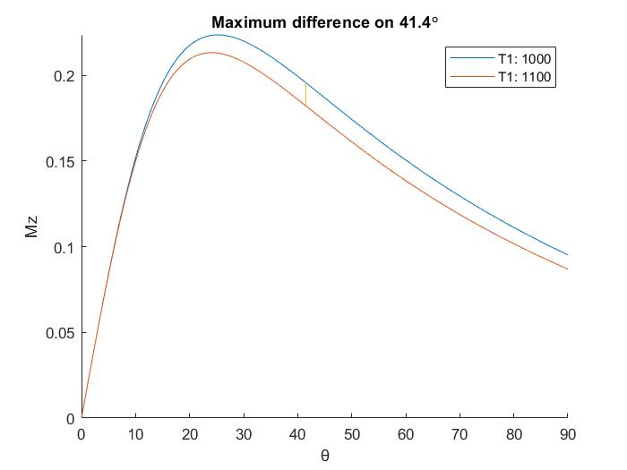
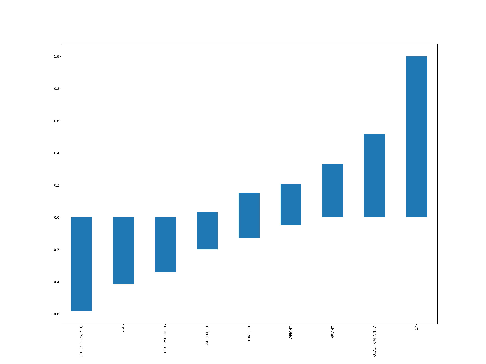

# MRI - HW2

In this homework, we will discuss three topics.

* Mxy and Mz
* The angle of maximum brightness between two tissues
* The subcortical volumes and Correlation

## **Mxy and Mz**

Using the **``Matlab``**.

Simulate the timing of $M_z$ and $M_{xy}$.

There are two states in the timing:

* Excitation
* Relaxation

### **Excitation**

$M_{z}=Mz*cos\alpha$

$M_{xy}=Mz*sin\alpha$

### **Relaxation**

$M_{z}=1+(M_z-1) \times e^{-\frac{TR}{T1}}$

$M_{xy}=M_{xy} \times e^{-\frac{TR}{T2^\ast}}$

### **Iteration**

After times of RF excitation, $M_z$ and $M_{xy}$ will be stable.

## **The angle of maximum brightness between two tissues**

Using the **``Matlab``**.

We have two tissues, that means there are two T1 value: **1000** and **1100** ms.

By the equation:

$M\propto(\frac{(1-e^{-TR/T1}) \times sin\alpha}{1-e^{-TR/T1} \times cos\alpha})\times e^{-TE/T2^\ast}$

We can use `difference of number two` to find the angle of maximum brightness between two tissues.

## **The subcortical volumes and Correlation**

Using the **``python``**.

1. Read the ``nil.gz``  of MRI files.
2. Calculate volumes of each subcortical area.
3. Read the ``IXI.xls`` by pandas dataform.
4. Correlation analysis between volume and personal informations.

* label: get from ``FreeSurfer``

### Calculate volumes

First, read ``*.nii.gz`` files, and use **array logical** to calculate the volume by **sum** function.

Then, save the result to ``*.npy`` file, beacuse calculating needs to take a lot time.  
Next time we just need to load the file only.

### Correlation Analysis

