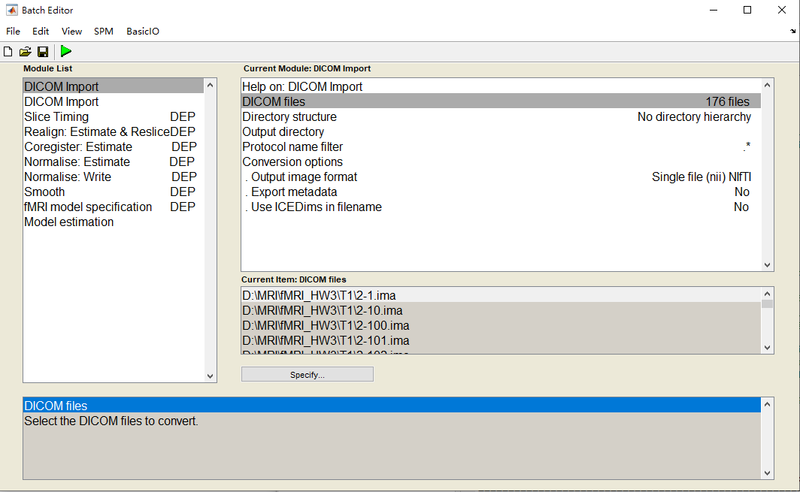
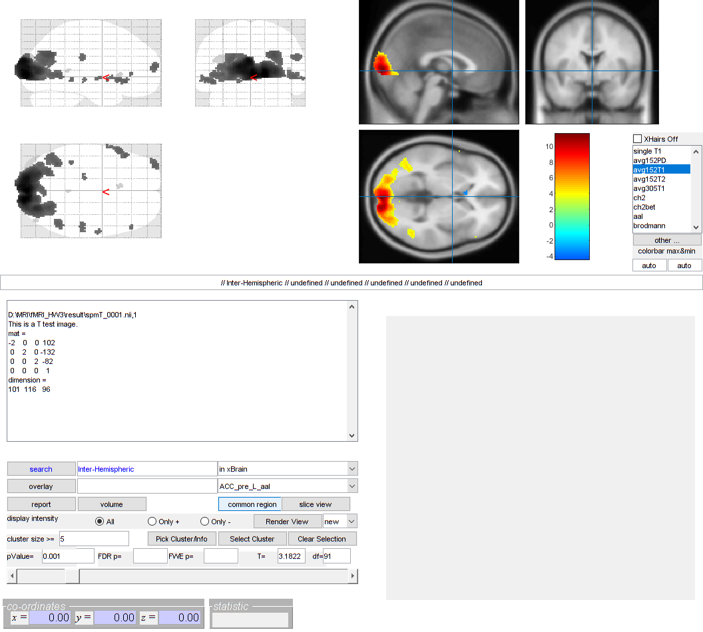
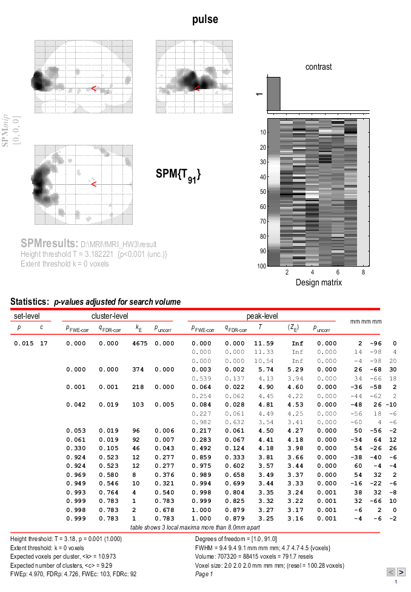
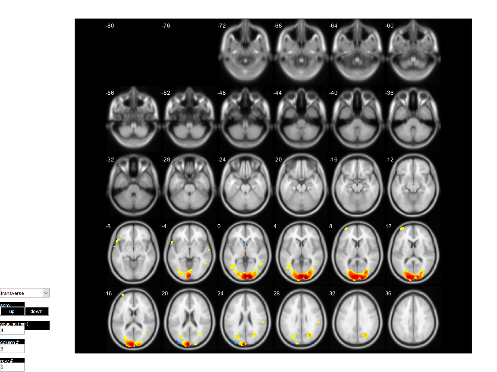

# HW3 - fMRI Analysis

## Introduction

請分析fMRI資料([block_design.zip](https://mailntustedutw-my.sharepoint.com/:u:/g/personal/m11107309_ms_ntust_edu_tw/Eef5u8fSgYFDtwJtTNPYtMoB9EImmMrev_vZGo1XVLfjjA?e=i3zsg6))，實驗資料解說如下

T1: (224, 256, 176)

fMRI: (64, 64, 12, 100): 20off_20on_20off_20on_20off

Analysis fMRI files, and analysis the action areas of brain.

## Tools

coding by Matlab tool.

* [SPM12](https://www.fil.ion.ucl.ac.uk/spm/software/spm12/)
* [xjview](https://www.alivelearn.net/xjview/)

## Usage

### SPM12

Load the file ``HW3.mat`` in SPM12.

Steps:

* read T1 and fMRI(EPI) files: DICOM to nil
* Slice Timing
* Realign: Estimate & Reaslice
* Coregister: Estimate
* Normalise: Estimate and Write
* Smooth
* fMRI Model Specification
* Model Estimation
* Result Review

More details about SPM Steps in [images/spm](images/spm/).

### xjview

Open ``image.nil`` by xjview after Result Reivew by SPM12.

## Results

## Reference

[SPM12](https://www.fil.ion.ucl.ac.uk/spm/doc/spm12_manual.pdf#Chap:data:auditory)

[fMRI Tutorial](https://andysbrainbook.readthedocs.io/en/latest/fMRI_Short_Course/fMRI_Intro.html)

[fMRI Analysis by nycu](http://cflu.lab.nycu.edu.tw/MRI_PrinApp_Class16_CFLu.pdf)
