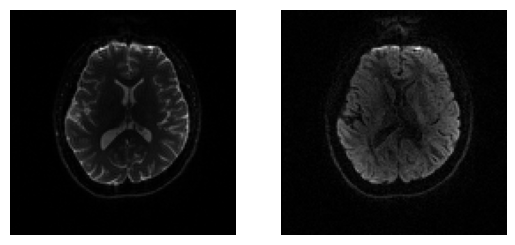
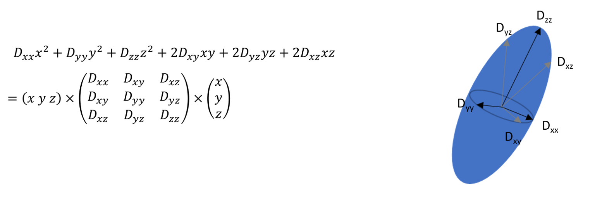
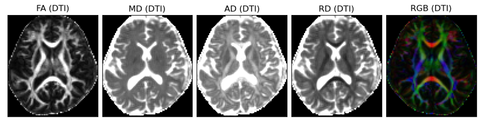
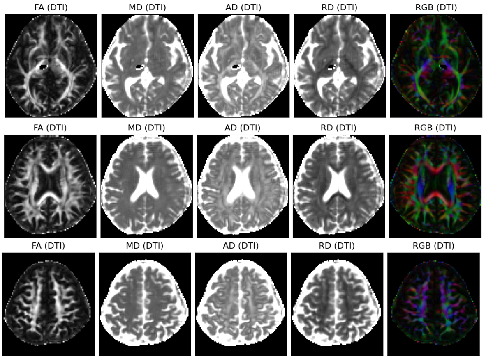
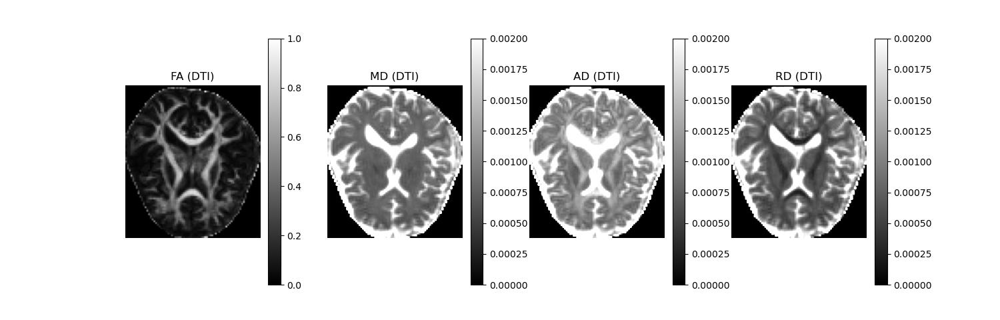
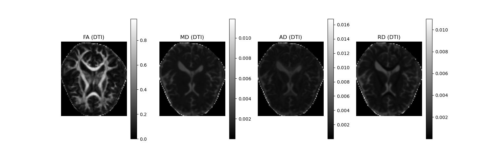

# HW4-DTI

有一天來自大華醫院的王醫生傳來一份DICOM資料，「湯姆，你能否幫忙分析一下DTI資料。」之後傳來了"DICOM_T1_DTI_dtionly.zip"。

王醫生於醫學會抄下了一些DTI分析的關鍵字"dcm2niix, ADC, DTI, FA, FSL, DIPY, GM, WM segmentation, subcortical ADC values, tractography"

除此之外對資料一無所知。請幫助湯姆進行分析。參考講義產出相關分析結果。

## Diffusion-weighted Image

$𝑆={𝑆_0} 𝑒^{−𝑏𝐷}$

$𝑏= \gamma ^2 G^2 \delta^2 (\Delta−\delta/3)$

### Diffusion Tensor Imaging

### Fractional Anisotropy

$𝐹𝐴=\sqrt{\frac{1}{2}*\frac {{(λ_1−λ )^2+(λ_2−λ)^2+(λ_3−λ)^2}}{λ_1^2+λ_2^2+λ_3^2}}  $

### Mean diffusivity

$𝑀𝐷=\frac{λ_1+λ_2+λ_3}{3}$

### Axial Diffusivity

$𝐴𝐷=λ_1$
### Radial diffusivity

$𝑅𝐷=\frac{λ_2+λ_3}{2}$

## [Coding](HW4.ipynb)

Using the ``python`` to coding.

* DIPY
* numpy
* matplotlib
* scipy

## Result

## Discussion

* Diffusion-weighting gradients can lead to eddy currents  artifacts
* Denoise using Marcenko-Pastur PCA algorithm
* Kurtosis Tensor Model

## [Dataset](https://mailntustedutw-my.sharepoint.com/:u:/g/personal/m11107309_ms_ntust_edu_tw/EfWzul-cjvFAqFZ0voL9DfMBlg3hCM0WFmT__we8HsN64A?e=aR90gY)
