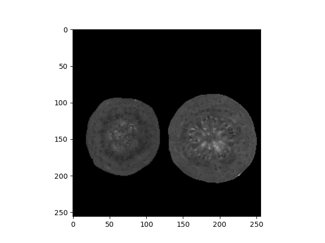

# MRI - HW1

In this homework, we need to find the **TE** of each pixel from T2 image.

## Install packages
Before starting, need to **install packages** of python.

Install in Terminal:

```bash
pip install -r requirements.txt
```

* `pydicom`: To read DCM file
* `numpy` and `scipy`: To calculate
* `matplotlib`: To plot the image 

## Run 

Run `Python` in Terminal:

```bash
python ./HW1.py
```

## DCM

First, we need to read the `DCM` file to get information of T2 image.  
We can use [DCM Table](https://www.dicomlibrary.com/dicom/dicom-tags/) to read effectively.

    (0018,0080)	DS	Repetition Time	
    (0018,0081)	DS	Echo Time

In the folder of HW1, there are two kinds of T2 image:


## T2

We can see the value of T2 image declines over time:

![T2 in pixel[150, 50]](images/T2.150.50.png)

So according to the function:

$M=M_0*e^{T2/TE}$

We can use **`Curve fitting`** to find the $T2$ and $M_0$.


## Result

Too slow to find all TE of pixel, so we setting a threshold to skip noise of backgraound.

    If value of pixel < 270:
        skip

After scan over images, we can mapping a new image of T2 which the value is TE of pixels from image1 ~ image12.



